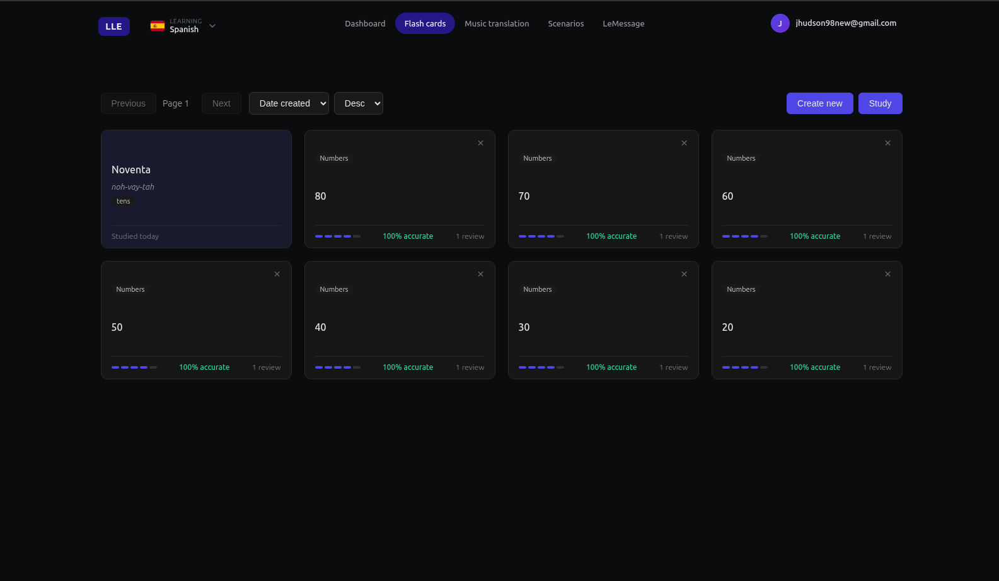
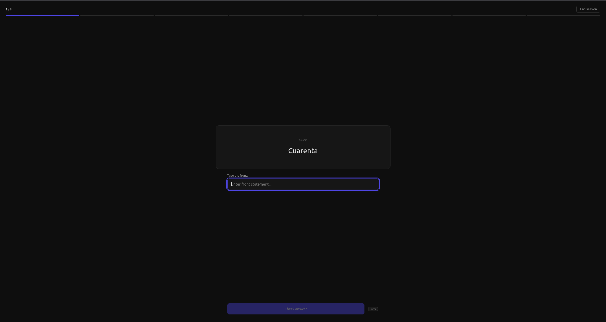
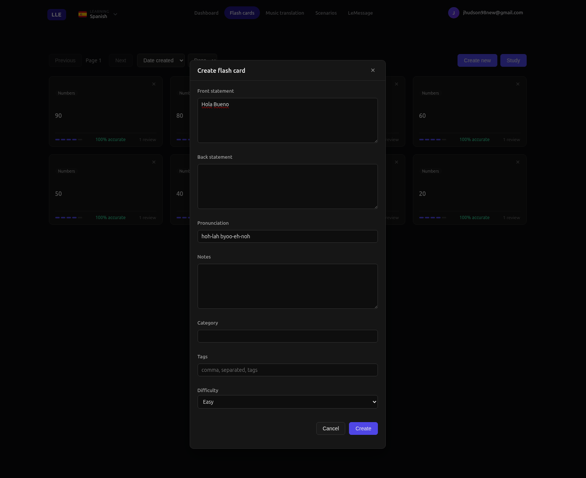

# Flashcards

Meet a word or phrase while chatting, translating a song, or roleplaying? Save it as a flash card with one tap. Then review your cards in short, smart study sessions that focus on the ones you keep getting wrong.

---

## What You Can Do

- **Save cards from anywhere** — every part of LLE (chat, songs, scenarios, messenger) lets you create a card on the spot.
- **Flip to check yourself** — browse your cards in a grid and tap to reveal the answer, pronunciation, and notes.
- **Study sessions that work** — pick how many cards to review (5, 10, 20, 50, or 100). The app shows you the ones you struggle with most first.
- **Grade yourself honestly** — after you answer, you decide if you got it right. The app tracks your streaks and accuracy over time.
- **Stay organised** — add notes, tags, and categories to keep your cards tidy and searchable.

It's like having a stack of flashcards that follows you everywhere — and never lets you forget the hard stuff.
