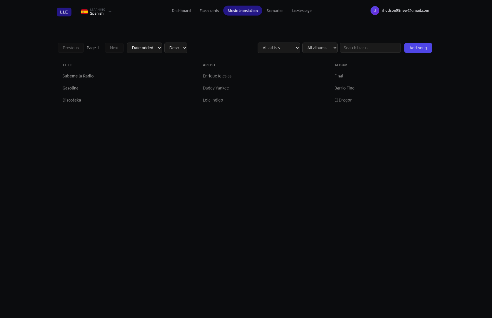
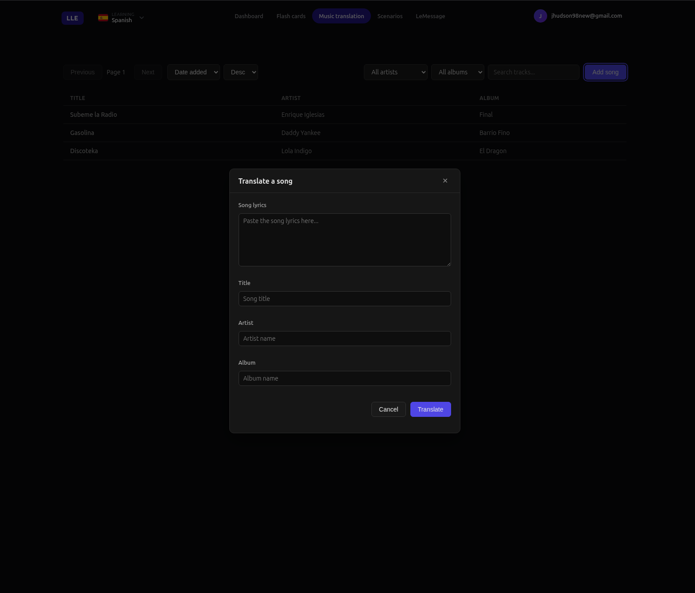
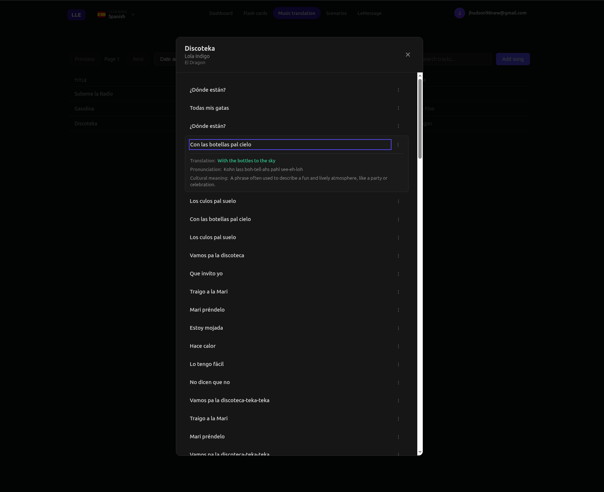

# Song Translation

Learn a language through music. Paste in any song and get every line translated with pronunciation and cultural context — so you can sing along and actually understand what you're saying.

---

## What You Can Do

- **Translate any song** — just enter the title, artist, and lyrics. The app breaks it down line by line.
- **See how to say it** — every line includes a pronunciation guide that adapts to the language (Pinyin for Chinese, Romaji for Japanese, and more).
- **Understand the culture** — get notes on idioms, cultural references, and why certain phrases are used.
- **Build your library** — all your translated songs are saved and searchable by artist, album, or title.
- **Turn lyrics into flashcards** — any line can become a flash card with one click, so you can review it later.

Music is one of the most natural ways to absorb a language. This feature makes sure you never have to guess what the lyrics actually mean.
