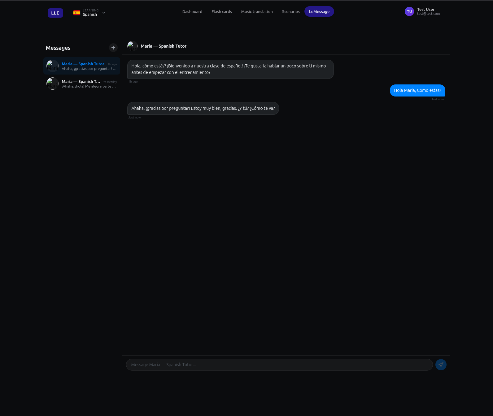

# AI Messenger

Chat with native speakers without the pressure of talking to a real person. LeMessage is a messenger app filled with AI characters — each one a native speaker with their own personality, backstory, and language.

---

## Characters You Can Meet

**16 unique characters across 16 languages:**

| Language | Characters |
|---|---|
| Spanish | María, Isabel |
| French | Pierre, Claire |
| Japanese | Yuki |
| German | Heinrich, Jonas |
| Italian | Sofia, Luca |
| English | Liam |
| Ukrainian | Oksana |
| Finnish | Eero |
| Portuguese | Miguel |
| Dutch | Sanne |
| Swedish | Elsa |
| Norwegian | Erik |
| Danish | Freja |
| Polish | Piotr |
| Czech | Eva |
| Hungarian | Adam |
| Mandarin | Mei |
| Korean | Hana |

---

## What You Can Do

- **Chat like you would on any messenger** — select a contact, type a message, and get a reply in character.
- **Get corrected gently** — when you make a mistake, the AI points it out with the correction and an explanation. No awkwardness, just learning.
- **Translate anything** — right-click any message to see an English translation, and save the pair as a flash card.
- **Save corrections as cards** — when a correction pops up, you can turn the mistake-and-fix pair into a flash card with one tap.

It feels like texting a friend who happens to be a native speaker and a teacher rolled into one.
