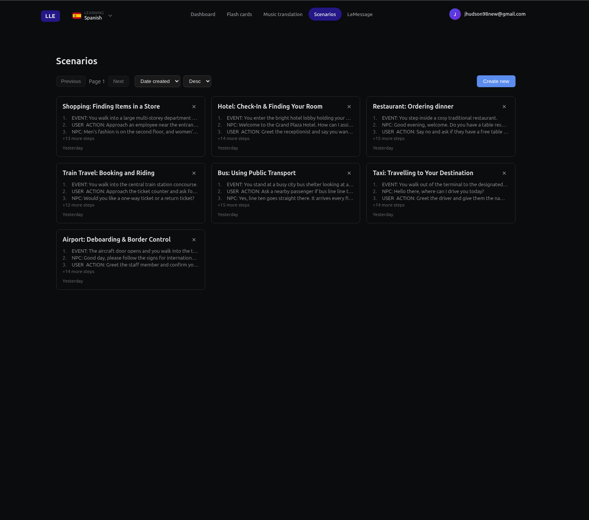
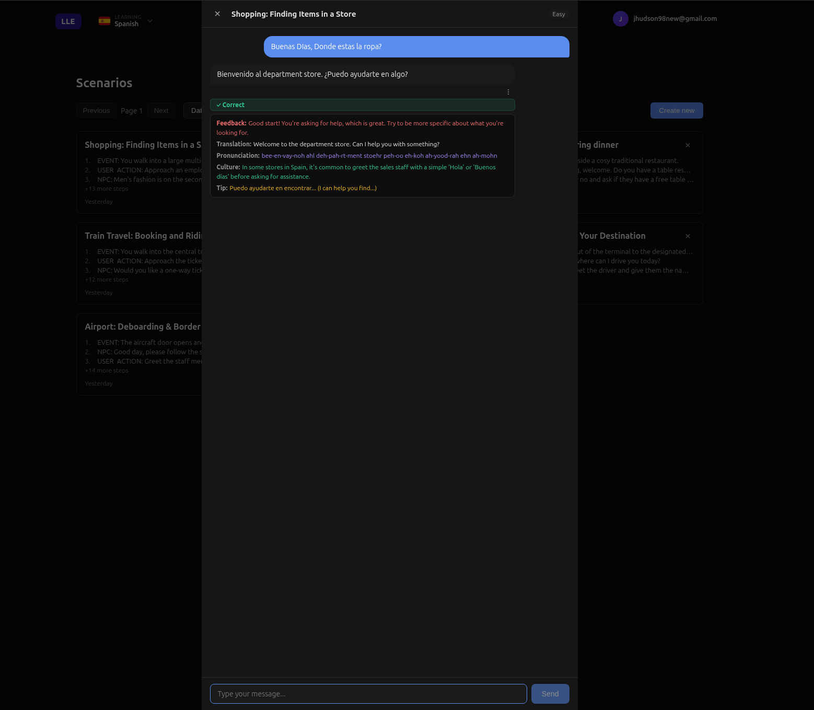

# Scenarios

Practise real-life situations before you actually live them. Order at a restaurant, catch a taxi, check into a hotel — all in your target language, with an AI guide who helps you every step of the way.

---

## What You Can Do

- **Choose from 7 real-world situations** — airport, taxi, bus, train, restaurant, hotel, and shopping. Each one plays out like a mini adventure.
- **Pick your difficulty** — Easy, Medium, or Hard. The app adjusts the vocabulary and pace to match your level.
- **Get detailed feedback** — after every message, the AI tells you if you got it right, explains why, and gives you a hint if you're stuck.
- **Learn the culture** — each response includes cultural context so you know not just *what* to say, but *why* they say it that way.
- **Save your mistakes** — turn any correction or response into a flash card on the spot.

No more awkward silences when you're actually there. Scenarios let you make all the mistakes in private so you get it right in real life.
