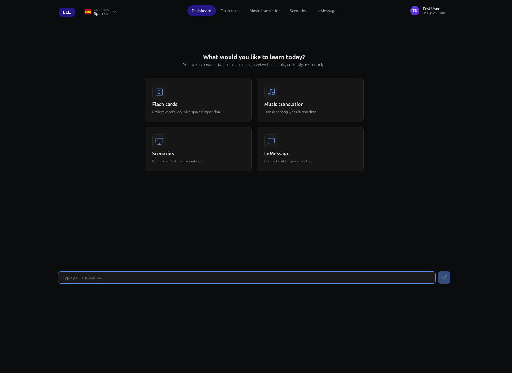

# LLE — Learn a Language by Living It

> **Talk. Translate. Roleplay. Review. Learn naturally.**



LLE is a free, open-source language learning platform built around one simple idea:

**The best way to learn a language is by using it.**

Instead of memorising endless vocabulary lists or completing repetitive exercises, LLE encourages you to immerse yourself in the language. Hold conversations with an AI tutor, practise real-world scenarios, translate your favourite songs, and save anything useful as a flashcard without ever leaving the application.

Everything is designed to reduce the friction of language learning. Rather than switching between translators, dictionaries, AI chatbots, pronunciation tools, and flashcard apps, LLE brings everything together in one place.

---

## Features

### AI Tutor

Your AI tutor is always available to answer questions, explain grammar, translate phrases, generate pronunciation, and help you understand why native speakers say things the way they do.

Whether you're asking a simple question or holding a full conversation, the tutor adapts to your level and helps you improve naturally.

---

### AI Messenger

Practise with a collection of AI characters, each with their own personality, interests, and way of speaking.

Chat casually, ask for recommendations, discuss hobbies, or simply make conversation. The focus is on helping you become comfortable communicating in your target language through realistic interactions.

---

### Song Translation

Music is one of the most enjoyable ways to learn a language.

Paste in your favourite lyrics and LLE will translate each line, generate pronunciation, and explain idioms, slang, and cultural references that are often lost in literal translations.

---

### Smart Flashcards

Whenever you discover a useful word or phrase, save it instantly with a single click.

Flashcards are integrated throughout the application, making it easy to build vocabulary naturally as you learn instead of maintaining separate study lists.

Reviews focus on the words and phrases you struggle with most, helping you spend less time reviewing things you already know.

---

## Why LLE?

Most language learning tools focus on isolated exercises.

LLE focuses on using the language first.

Instead of learning vocabulary and hoping you'll remember it later, you encounter words naturally through conversations, roleplay, music, and exploration. When you find something worth remembering, saving it takes a single click.

The goal is simple:

**Spend more time interacting with the language and less time managing the tools used to learn it.**

---

## Getting Started

Start the app:

```bash
npm start
```
or
```bash
dotnet run --project App/Code/Core/Application
```

By default, **Single User Mode** is enabled, so you'll be signed in automatically when the application starts.

If Single User Mode is disabled, the default administrator account is:

```
Email: admin
Password: admin
```

---

## Technology

LLE is built using:

* ASP.NET Core
* C#
* TypeScript
* AI provider abstraction supporting OpenAI, Ollama, Mistral, and other compatible providers

---

## Contributing

Contributions are always welcome.

Whether you'd like to report a bug, improve documentation, suggest a feature, or submit code, feel free to open an issue or create a pull request.

---

## License

LLE is released under the project's license.

---

## Free. Open Source. Forever.

LLE will always be free to use.

There are no subscriptions, premium tiers, locked features, or artificial usage limits.

The project is developed in the open so anyone can inspect the code, contribute improvements, or adapt it to their own needs.
